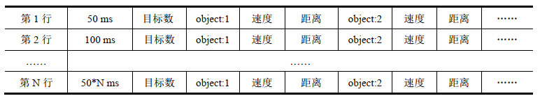

# ObjectTracking
A repository for object tracking/detection for low-altitude radar.

## data preparation
### echo sequence data
> see details at https://www.scidb.cn/en/detail?dataSetId=720626420979597312#p1
#### download
after running
```bash
cd ./data/echo_sequence
python ./download.py
```
you will get .7z files
#### extract
> test on linux
1. download 7zip
```bash
sudo apt-get install p7zip-full
```
2. extract data1 (for example)
```bash
7z x data1.7z.001
```
the command will automatically collect all data from data1.7z.001, data1.7z.002, etc. and extract them to directory 'data1'
#### description
1. data overview

|  name  |            scene info             |
|:------:|:---------------------------------:|
| data1  |  地物背景、高信噪比、 双目标、 目标由远及近、 时长 2 s   |
| data2  |   地物背景、中等信噪比、双目标、 目标由远及近、时长 2 s   |
| data3  |   地物背景、低信噪比、双目标、 目标由远及近、时长 2 s    |
| data4  |   地物背景、高信噪比、双目标、 目标由近及远、时长 2 s    |
| data5  |   地物背景、 中等信噪比、双目标、目标由近及远、时长 2 s   |
| data6  |    地物背景、低信噪比、双目标、目标由近及远、时长 2 s    |
| data7  |   地物背景、高信噪比、双目标、目标接近和远离、时长 4 s    |
| data8  |  地物背景、 中等信噪比、双目标、 目标接近和远离、时长 4 s  |
| data9  |    地物背景、低信噪比、双目标、目标由近及远、时长 6 s    |
| data10 |  地物背景、高信噪比、目标数目变化、目标由近及远、时长 6 s   |
| data11 | 地物背景、 中等信噪比、目标数目变化、目标接近和远离、时长 6 s |
| data12 |   地物背景、低信噪比、双目标、目标接近和远离、时长 4 s    |
| data13 |  地海背景、高信噪比、目标数目变化、目标由远及近、时长 6 s   |
| data14 | 地海背景、 中等信噪比、目标数目变化、目标由远及近、时长 6 s  |
| data15 |   地海背景、低信噪比、双目标、目标接近和远离、时长 6 s    |

2. details
+ there are three files in each directory: data*.mat, data*_gate.mat and data*_value.txt
+ data*.mat：回波数据样本，每个脉冲的采样点数固定为 319 个， 对于慢时间维， 脉冲重复频率为 32kHz，行序号代表慢时间脉冲数，列序号代表快时间采样点数
+ data*_gate.mat：距离波门数据样本，波门起始位置对应第一个采样点，在整个数据段中随目标移动，更新率为 1 ms（32
个脉冲更新一次）
+ data*_value.txt：标注真值数据样本，描述如下图所示
