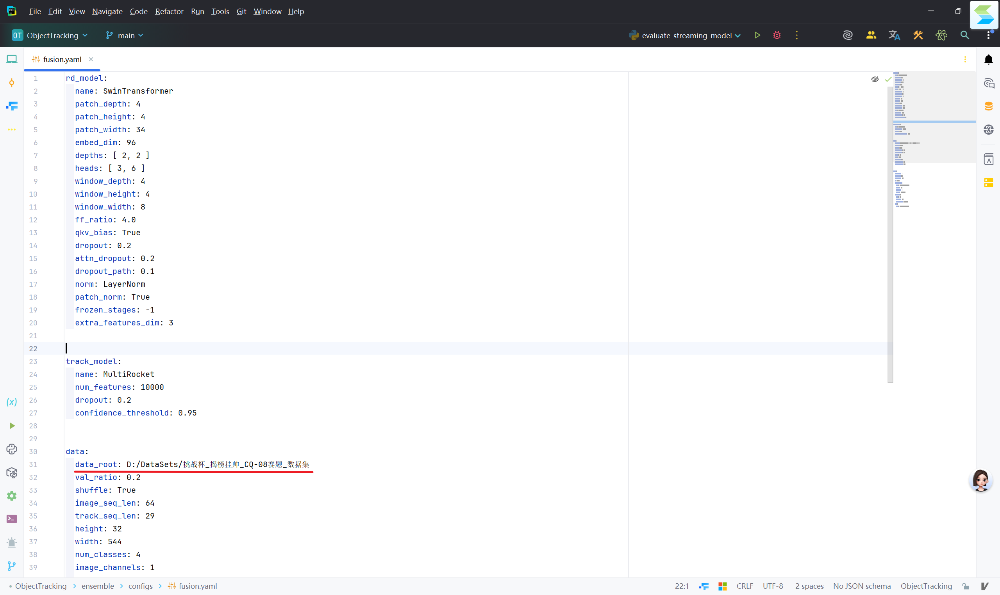
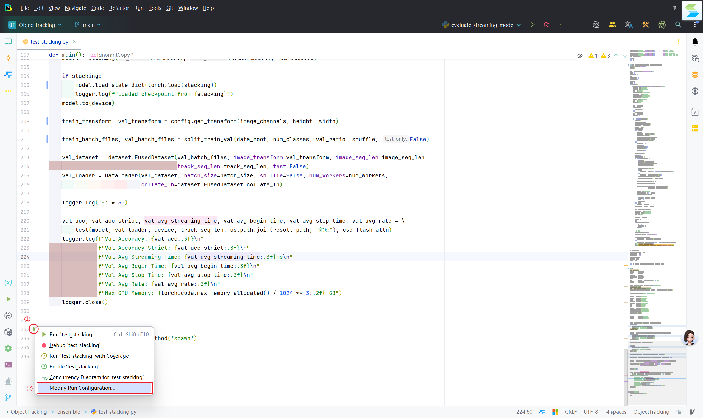
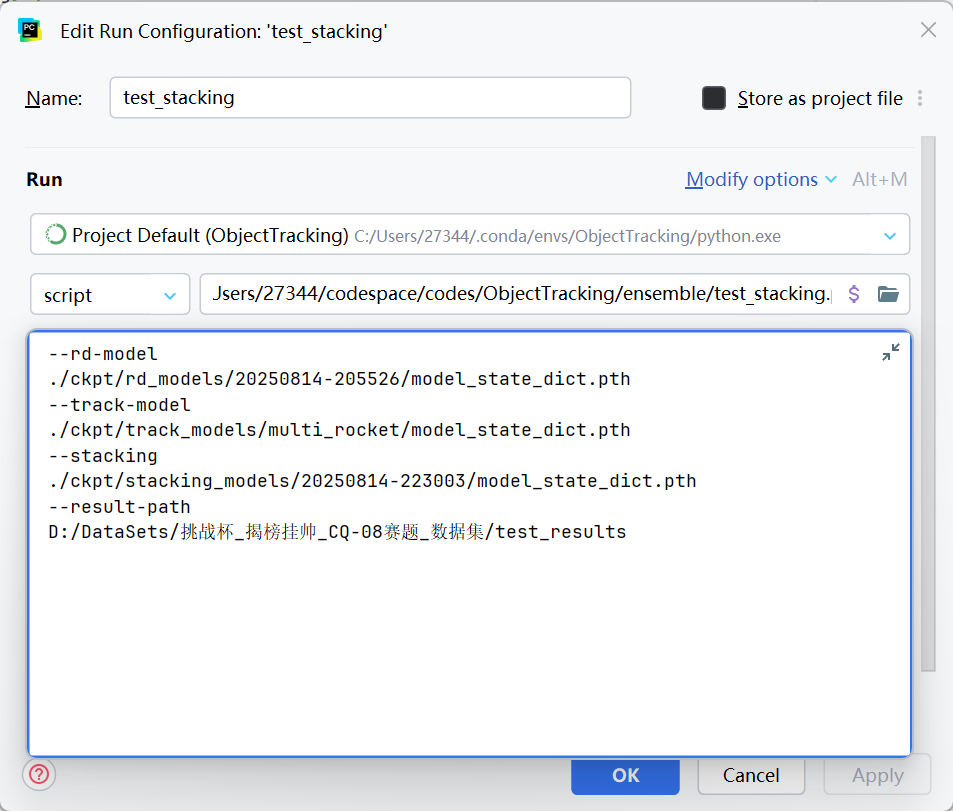

# 基于 Stacking 集成学习方法的低空监视雷达目标智能识别

## 1. 环境安装

1. 创建 conda 环境
```shell
conda create -n nju_dbw python=3.12 -y
```
2. 安装相应 cuda 版本的 pytorch
```shell
pip install torch==2.7.1 torchvision==0.22.1 torchaudio==2.7.1 -f https://mirrors.aliyun.com/pytorch-wheels/cu128
```
3. 安装其他依赖包
```shell
pip install -r requirement.txt
```

也可通过百度网盘下载打包好的 conda 环境：

## 2. 训练

### 2.1 RD 图预训练模型
```shell
cd rd
python train_rd.py --config-path ./configs/swin.yaml --log-path ./logs --device cuda --phase pretrain
```
需要修改 `configs/swin.yaml` 中的 `data_root` 路径为包含有点迹、航迹、原始回波文件夹的根目录。
### 2.2 点航预训练模型
```shell
cd track
python train_streaming_simple.py
```
需要修改 `configs/config.py` 中的 `DATA_ROOT` 路径为包含有点迹、航迹、原始回波文件夹的根目录。
### 2.3 集成学习模型训练
```shell
python train_stacking.py --config-path ./configs/fusion.yaml --log-path ./logs --device cuda --rd-model <path_to_your_rd_model> --track-model <path_to_your_track_model>
```
需要修改 `configs/fusion.yaml` 中的 `data_root` 路径为包含有点迹、航迹、原始回波文件夹的根目录。
## 3. 推理

> 推荐使用 PyCharm 打开本项目

```shell
python test_stacking.py --config-path ./configs/fusion.yaml --log-path ./logs --device cuda --rd-model <path_to_your_rd_model> --track-model <path_to_your_track_model> --stacking <path_to_your_stacking_model> --result-path <path_to_save_results>
```
需要修改 `configs/fusion.yaml` 中的 `data_root` 路径为包含有点迹、航迹、原始回波文件夹的根目录：



对于提交的 ensemble 文件，可以在可视化界面中输入参数 `--rd-model ./ckpt/rd_models/20250814-205526/model_state_dict.pth --track-model ./ckpt/track_models/multi_rocket/model_state_dict.pth --stacking ./ckpt/stacking_models/20250814-223003/model_state_dict.pth
--result-path <保存航迹结果文件的路径>`，具体如下图所示：

1. 打开参数编辑界面：



2. 在对应位置输入参数：

