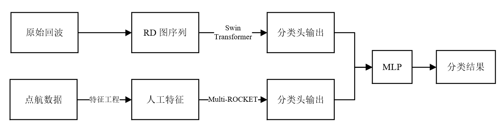
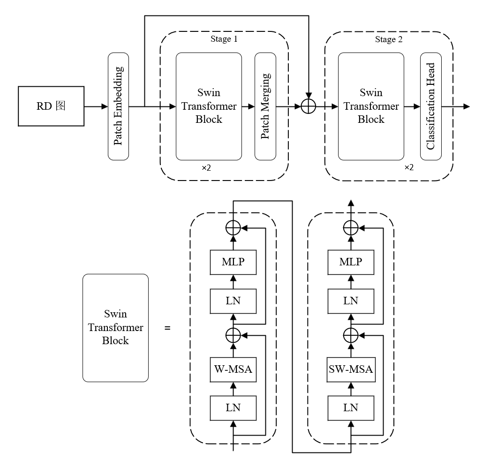

# 基于 Stacking 集成学习方法的低空监视雷达目标智能识别

## 1. 整体架构

对于 RD 图和点航数据两种不同形式的数据，本团队采用 Stacking 集成学习方法，先针对两种数据预训练两种模型，即 RD 图模型和点航模型，
然后将这两个模型作为基学习器，将两个模型的预测结果作为输入，学习一个简单的新分类头。

## 2. RD 图模型

### 2.1 RD 图生成

### 2.2 数据预处理

### 2.3 模型架构
整体参考 3D Swin Transformer 模型，不同于原作者开发的模型，本模型在复杂度上更低，只有两个 Stage，
并且每个 Stage 中的 Swin Transformer Block 只有两层。在不同 Stage 之间添加了残差连接，以利用不同尺度的特征，并采用卷积操作实现。

## 3. 点航模型

### 3.1 数据预处理

### 3.2 特征工程

### 3.3 模型介绍

Multi-ROCKET 算法是一种基于 ROCKET 算法的改进算法，包含三个关键步骤：

1. 随机卷积核生成：随机生成多个卷积核，每个卷积核大小为 9 × 9，并控制其中权重只有两种元素
2. 池化操作：对于每个卷积核，计算四个特征作为输出：正值比例 (PPV)、正值均值 (MPV)、正值平均索引 (MIPV)、最长连续正值长度 (LSPV)
3. 分类头：采用岭回归分类器，对于大规模数据集，推荐采用逻辑回归分类器

为了实现支持 GPU 加速的 Multi-ROCKET 模型，本模型主要对第三步进行了修改，采用全连接层作为分类器

## 4. 集成学习

### 4.1 集成方法

采用 Stacking 集成学习方法，将 RD 图模型和点航模型作为基学习器，将两者的预测结果作为输入，通过一个学习器进行融合，得到最终的预测结果。

### 4.2 集成模型架构

新学习器采用的架构为两层全连接层，第一层输出维度为 512，激活函数为 ReLU，中间采用 Batch Normalization 进行归一化